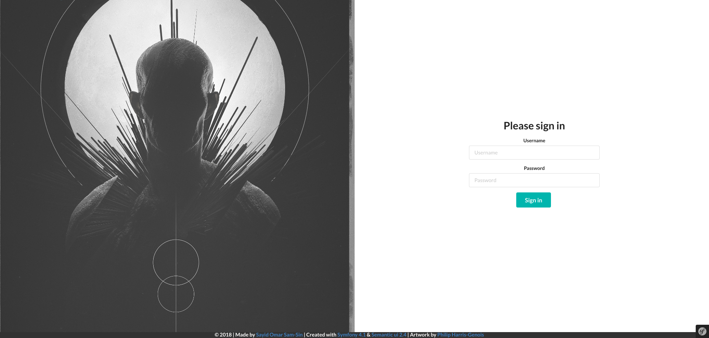
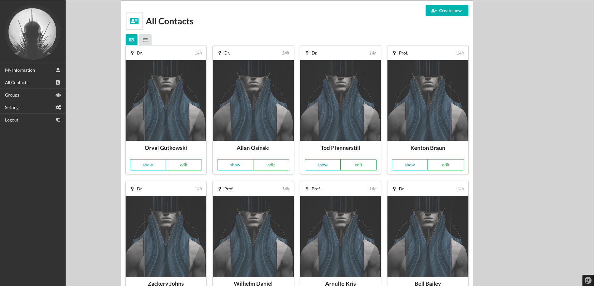
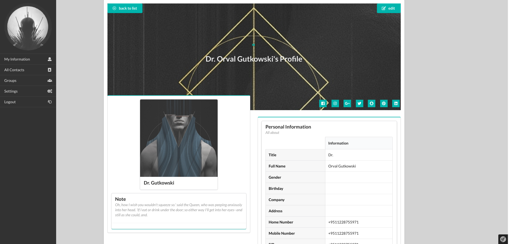

# Pipel - Address Book

## Screenshots
> Login Page

> Contact Overview

> Single Contact
 
## Technology used
- [Symfony 4.1.7](https://symfony.com)
- [Doctrine 2.6](https://www.doctrine-project.org/)
- [Semantic UI 2.4](https://semantic-ui.com/)
- [Font Awesome](https://fontawesome.com/)
- [Webpack](https://webpack.js.org/)
- [Composer](https://getcomposer.org/)
- [Yarn](https://yarnpkg.com/en/)
## Props
- Artwork : [Philip Harris-Genois](https://www.artstation.com/pharrisgenois)