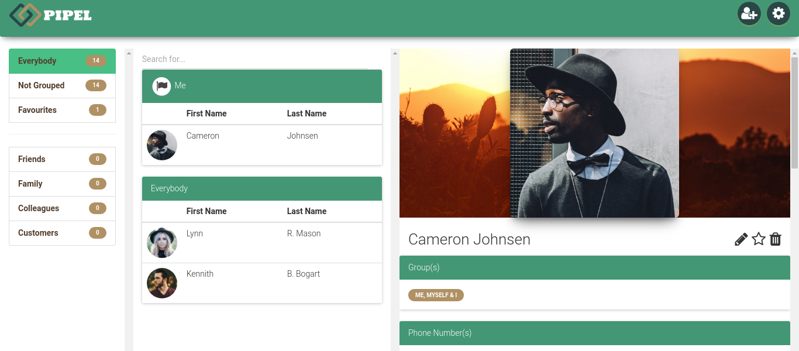

# Pipel - Address Book

## ToDo for V1
- [ ] Complete design with models and input fields
- [ ] Create database with doctrine
- [ ] Input dummy data into the database
- [ ] Make the whole address book functional with Symfony
- [ ] Clean code and leave comments
## Special Thanks and Credits
- logo : [Free Logo Design](https://www.freelogodesign.org)
- Images : [Unsplash](https://unsplash.com)
- Names : [Fake Name Generator](http://www.fakenamegenerator.com)
- Icons : [Font Awesome](http://fontawesome.io)
- Web Tech : [PHP 7](http://php.net), [Symfony 3](https://symfony.com), [HTML5 & CSS3](https://www.w3.org), [Bootstrap 3](http://getbootstrap.com), [Material Kit Free](https://www.creative-tim.com/product/material-kit), [JQuery](http://jquery.com)
